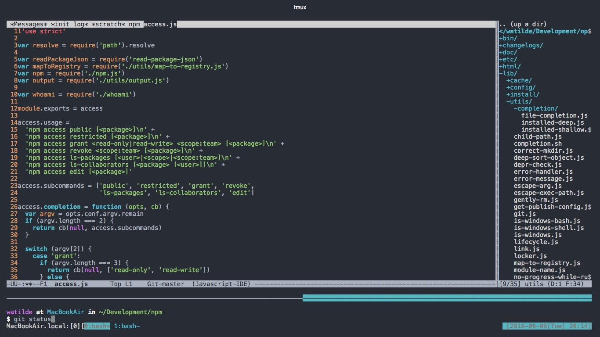

# watilde's dotfiles


## Dependencies
+ emacs
+ fish
+ fisherman
+ tmux
+ vim
+ zsh

## Install via chest
```
$ cd ~
$ npm install -g chest
$ git clone git@github.com:watilde/dotfiles.git .chest
$ chest open
```
